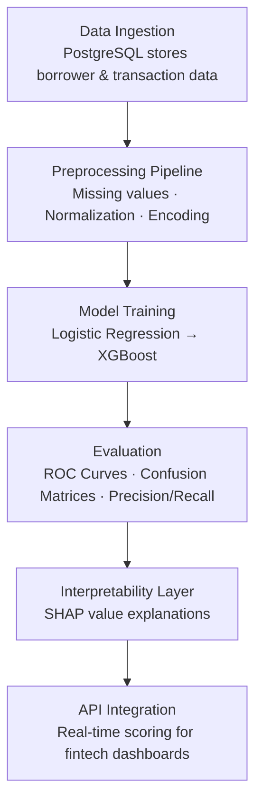

# AI-Powered Credit Scoring for Loan Approvals


## Project Overview
Credit scoring is the backbone of modern lending. Traditional scoring models often fail to capture nuanced borrower behavior, limiting financial inclusion and increasing default risk.  

**CrediAI** *by [Pratik Chaudhari](https://github.com/prxtxks)* is an AI-powered credit scoring system designed to automate and improve loan approvals. It leverages machine learning to predict borrower risk more accurately, while remaining interpretable and practical for real-world deployment.

**Goal:** Build a scalable, data-driven loan approval engine deployable by banks, fintech startups, or micro-lending organizations.  

## Tech Stack
- **Programming:** Python  
- **ML Libraries:** Scikit-Learn, XGBoost  
- **Database:** PostgreSQL  
- **Data Handling:** Pandas, NumPy  
- **Visualization:** Matplotlib, Seaborn, Plotly  
- **Explainability:** SHAP, LIME  
- **Deployment Ready:** Flask / FastAPI  

## System Workflow



## Visualizations
During project execution, generate and showcase:  
- Correlation Heatmaps (Seaborn)  
- ROC Curves & Confusion Matrices (Matplotlib / Yellowbrick)  
- SHAP Summary Plots (Explainability)  
- Interactive Dashboards (Plotly, Tableau, Power BI – optional)  

## Results & Insights
- **Baseline Models (Logistic Regression):** ROC-AUC ≈ 0.72  
- **Advanced Models (XGBoost):** ROC-AUC > 0.85  
- **Key Insight:** Transaction history + debt-to-income ratio outperform raw credit scores.  
- **Business Impact:** 15–20% reduction in defaults + expanded access for underbanked communities.  

## How to Run Locally

```bash
# Clone Repository
git clone https://github.com/yourusername/credi-ai.git
cd credi-ai

# Setup Environment
pip install -r requirements.txt

# Run Preprocessing
python scripts/preprocess.py

# Train Model
python scripts/train.py

# Evaluate
python scripts/evaluate.py
```

## Inspiration

Financial decision-making is often left to humans combing through spreadsheets, missing subtle patterns.

Yet, that is exactly what we ask of our best financial analysts. They hunt for correlations, spot anomalies, and calculate risk while the underlying patterns hide in the noise.

That's why: **CrediAI**: an AI-powered credit scoring assistant that processes complex borrower data instantly, highlights critical risk factors, and provides actionable insights to improve decision-making.

